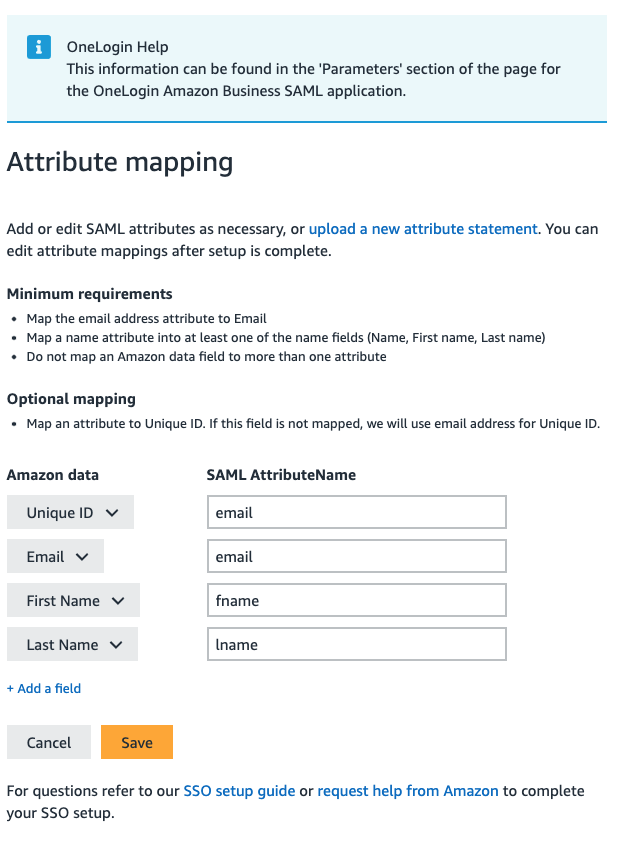

## Amazon Business

N.B I've left this based on **.co.uk** but have it setup on other domains.

## Onelogin Settings

Click to expand!

- Applications -> Add App.
- SAML Custom Connector (Advanced)

### Info
- Amazon Business (Country)
- Icons 

### Configuration

First Header  | Second Header
------------- | -------------
RelayState  | 
Audience (EntityID)  | `https://www.amazon.co.uk`
Recipient  | `https://www.amazon.co.uk/bb/feature/sso/action/3p_redirect?idpId=1234`
ACS (Consumer) URL Validator*  | `^https:\/\/www\.amazon\.co\.uk\/bb\/feature\/sso\/action\/3p_redirect$`
ACS (Consumer) URL*  | `https://www.amazon.co.uk/bb/feature/sso/action/3p_redirect?idpId=1234`
Single Logout URL  | 
Login URL  | `https://www.amazon.co.uk/bb/feature/sso/action/3p_redirect?idpId=1234`
SAML not valid before  | 3
SAML not valid on or after  | 3
SAML initiater  | OneLogin
SAML nameID format  | Email
SAML issuer type  | Specific
SAML signature element  | Response
Encrypt assertion  | [ ]
SAML encryption method  | TRIPLEDES-CBC
Send NameID Format in SLO Request  | [ ]
Sign SLO Request  | [ ]
SAML sessionNotOnOrAfter  | 1440
Generate AttributeValue tag for empty values  | [ ]
Sign SLO Response  | [ ]
SAML Encryption  | 

## Parameters

| SAML Custom Connector (Advanced) Field      | Value |
| ----------- | ----------- |
| NameID (fka Email)     | Email       |
| email   | Email `*`       |
| fname   | First Name `*`        |
| lname   | Last Name `*`        |

`*` ☑️ Include in SAML assertion

## Rules

## SSO

## Acess

Assign it to yourself for testing

## Users

## Privileges

## Amazon Business Settings

Click to expand!

## Troubleshooting - Extras

Error:

`Assertions could not be parsed from the request. Ensure the assertions are being sent and are encrypted by the IDP.`

- Make sure **Encyrpt Assertion** is unticked in the Onelogin Settings (yes, unticked)

### Multiple Companies

- If you have users with access to multiple companies you can't use the same email address. Amazon will tell you the email "Is already a memeber of another company.

- Create another SAML Custom Conenctor with the same steps above.

- Then OneLogin Macros to the rescue!
https://onelogin.service-now.com/kb_view_customer.do?sysparm_article=KB0010609

Go the Parameters and change the SAML Custom Connector...

Let's say you want **john.doe+custom@onelogin.com**

**NameID** -> Value -> Macro and `{username}+custom@{email_domain_part}`
**email** -> Value -> Macro and `{username}+custom@{email_domain_part}`

This is assuming the username is `john.doe` and the email domain is `onelogin.com`

So you can have mutiple companies for each user

